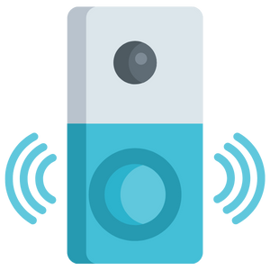

<p align="center">
  <a href="" rel="noopener">
 </a>
</p>

<h3 align="center">Smart Doorbell</h3>

<div align="center">

[]()

</div>

---

<p align="center"> Smart Doorbell
    <br> 
</p>

## 📝 Table of Contents

- [About](#about)
- [Getting Started](#getting_started)
- [Circuit](#circuit)
- [Usage](#usage)
- [List Of Components](#list)
- [Built Using](#built_using)
- [Authors](#authors)

## 🧐 About <a name = "about"></a>

This repo contains

- Backend
- Firmware
- Detailed instructions

for Smart Doorbell.

## Getting Started <a name = "getting_started"></a>

These instructions will get you a copy of the project up and running on your system.

### Prerequisites

Things you need to install the FW.

```
- Raspberry Pi
```

### Installing <a name = "installing"></a>

A step by step series that tell you how to get the Firmware and Backend running

#### Raspberry Pi Configuration


## Circuit <a name = "circuit"></a>

### Raspberry Pi Pinout

Follow the pinout diagram given below to connect different components to your Raspberry Pi


### Complete Circuit Diagram

Here's the complete circuit diagram of the system.


#### Fimrware


## Usage <a name = "usage"></a>


## List of Components <a name = "list"></a>

Following components are used to make this project

1.  

## ⛏️ Built Using <a name = "built_using"></a>

- C++

## ✍️ Authors <a name = "authors"></a>

- [@Nauman3S](https://github.com/Nauman3S) - Development and Deployment
